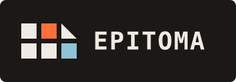

# EPITOMA

<div align="center">

  



**[Live demo](https://alikhalilit.github.io/EPITOMA/)**

</div>

EPITOMA is the resume builder of the [VITA](https://github.com/AliKHaliliT/VITA) ecosystem. *Epitoma* is Latin for an abridgment of a larger work, which is exactly what a resume is to a *vita*. This app takes your whole record and condenses it into print-ready resumes and CVs.

The builder runs as a single React and Vite page with no server, and your documents stay in your browser. The repository's documentation and engineering conventions follow [My-Styles](https://github.com/AliKHaliliT/My-Styles).

---

## The ecosystem

EPITOMA is one of three sister repositories.

| App | Role | Demo |
| --- | --- | --- |
| [**VITA**](https://github.com/AliKHaliliT/VITA) | Renders the record as the public site | [alikhalilit.github.io/VITA](https://alikhalilit.github.io/VITA/) |
| [**TABULARIUM**](https://github.com/AliKHaliliT/TABULARIUM) | Edits every ledger and publishes the seed files | [alikhalilit.github.io/TABULARIUM](https://alikhalilit.github.io/TABULARIUM/) |
| **EPITOMA** (this repo) | Condenses the record into resumes and CVs | [alikhalilit.github.io/EPITOMA](https://alikhalilit.github.io/EPITOMA/) |

The three apps talk through files rather than imports, and this repo carries its own copy of the snapshot contract in `src/shared/contract/portfolio.ts`, versioned under the `vita-portfolio` format name.

---

## How the builder fits

EPITOMA sits at the read-only end of the ecosystem. It never writes to the record, which is why connecting it to a repository asks for no token. Given a public VITA repository, it fetches the branch head over GitHub's public API, parses the same seed files the site builds from, and assembles them into the identical snapshot the admin panel would export. The offline path is that snapshot itself, a `portfolio.json` you import as a file.

Everything after that happens in your browser. Documents are composed and stored locally, and syncing against a fresh copy of the record updates the synced content while leaving your ordering, custom sections, and styling alone. When the record changes upstream, whether through the admin panel or a hand commit, one Sync brings the documents up to the repository's head.

Every styling decision resolves through a single layout contract shared by the preview and all of the exporters, so a setting means the same thing on the screen, in the PDF, in the Word file, and in the LaTeX source. The PDF is generated inside the browser with the catalog fonts embedded, which means the hosted demo is the complete app, with no server behind any part of it.

---

## Features

- **Two content sources, both read-only.** You can import a `portfolio.json` exported by the admin panel, or point the Repo button at any public VITA repository and let Sync pull the profile, palette, and content straight from its head. It needs no token because it never writes anywhere.
- **Sync that respects your edits.** Refreshing matches content by source id, so your section order, hidden entries, custom sections, and styling all survive it.
- **A physical preview.** The document lays out as real separated pages, exactly as it prints. No block ever straddles a page boundary, headings keep their first entry with them, and the footer runs in every page's bottom margin.
- **Templates per document kind.** Resumes and CVs get distinct sets, every template card is a real typeset miniature, and a sample-data mode lets you judge any look full-size without your record in the way.
- **A Customize panel built like an instrument.** It has machined gauge sliders, pixel toggles, font pickers that show every face in itself, option tiles that preview what each choice does, and resets per pane as well as for everything at once.
- **Sidebar layouts.** A full-height tinted rail carries the reference sections, each section can be assigned to the main column or the rail, dark fills flip their type to light, and languages can render as proficiency dots.
- **Four export formats from one layout contract.** The PDF generates directly in the browser with embedded fonts, vector icons, and no print dialog. Word and LaTeX are structural translations of the same contract, and the document `.json` is a perfect backup that re-imports exactly. The full mapping lives in [`docs/EXPORT-PARITY.md`](docs/EXPORT-PARITY.md).
- **Localized documents.** Dates and the open-ended range word render in English, UK English, French, German, Spanish, Turkish, or Azerbaijani, and they do so in every format.
- **Everything local.** Documents live in your browser's storage, and nothing leaves the machine.

---

## Getting started

The [hosted builder](https://alikhalilit.github.io/EPITOMA/) works as it stands. Click Repo and point it at a public VITA repository, or import a `portfolio.json` produced by the [admin panel](https://github.com/AliKHaliliT/TABULARIUM), then create a Resume or CV. A blank document works too and can be filled in by hand.

To run it locally instead, install and start it like any Vite app.

```powershell
npm install
npm run dev
```

The app opens on port 3200. VITA runs on 3000 and TABULARIUM on 3100, so all three run side by side. The hosted builder always runs the latest release; a local clone catches up with an ordinary `git pull`.

Contributors and coding agents should start at [`AGENTS.md`](AGENTS.md), which is the vendor-neutral entry point and the full documentation index.

---

## License

This work is under an [MIT](https://choosealicense.com/licenses/mit/) License.
